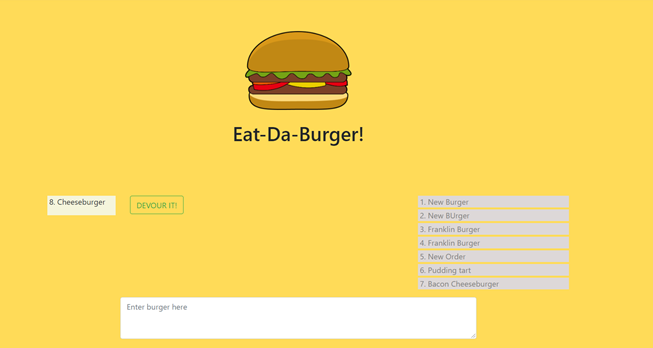

# the-burger-explosion

A simple game that allows the user to create burger orders and then -- devour them!

## Installation

This web app is made using the MVC model.  The front end is made in handlebars-express, with a main, index, and two partial views.  The data is stored in a mySQL database on JawsDB, used in the backend by sequelize.  Sequelize controls a single "burger" model while the main server operations/api routes are controlled by a server.js file and a single controller.js file.  

The application is deployed to: https://infinite-retreat-54274.herokuapp.com/

## Usage 

The user only sees the main page that has a place to create a burger, a list of the ordered items, and a list of the "devoured" items.  The user has the option of hitting a button to devour an individual meal, moving it from the left colum to the right

-----

Below is screenshot of the main page section.

## Credits

Created by: Christopher Cruzcosa

## License

Copyright (c) [2020] [Christopher Cruzcosa]

Permission is hereby granted, free of charge, to any person obtaining a copy
of this software and associated documentation files (the "Software"), to deal
in the Software without restriction, including without limitation the rights
to use, copy, modify, merge, publish, distribute, sublicense, and/or sell
copies of the Software, and to permit persons to whom the Software is
furnished to do so, subject to the following conditions:

The above copyright notice and this permission notice shall be included in all
copies or substantial portions of the Software.

THE SOFTWARE IS PROVIDED "AS IS", WITHOUT WARRANTY OF ANY KIND, EXPRESS OR
IMPLIED, INCLUDING BUT NOT LIMITED TO THE WARRANTIES OF MERCHANTABILITY,
FITNESS FOR A PARTICULAR PURPOSE AND NONINFRINGEMENT. IN NO EVENT SHALL THE
AUTHORS OR COPYRIGHT HOLDERS BE LIABLE FOR ANY CLAIM, DAMAGES OR OTHER
LIABILITY, WHETHER IN AN ACTION OF CONTRACT, TORT OR OTHERWISE, ARISING FROM,
OUT OF OR IN CONNECTION WITH THE SOFTWARE OR THE USE OR OTHER DEALINGS IN THE
SOFTWARE.